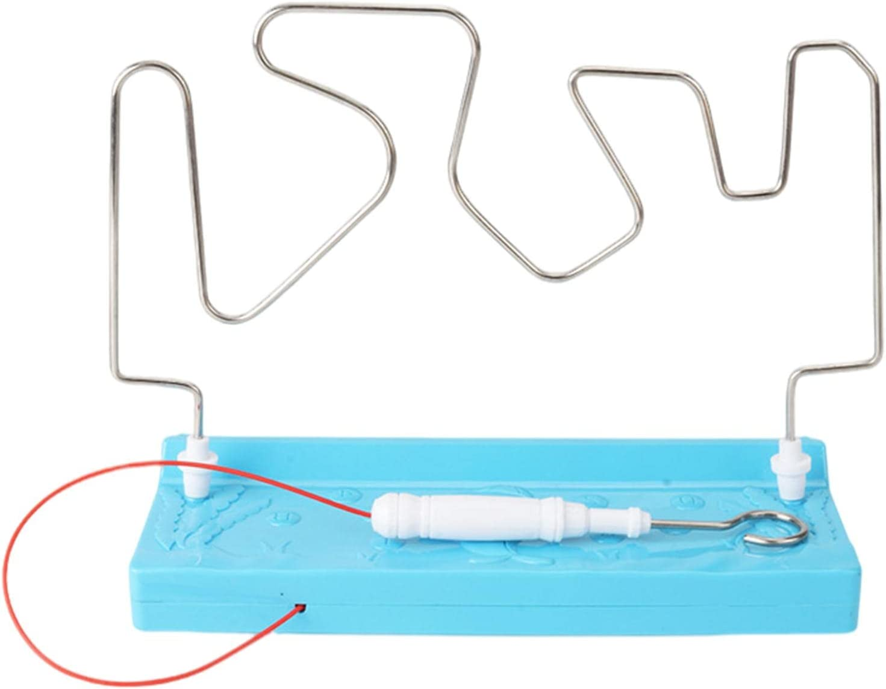
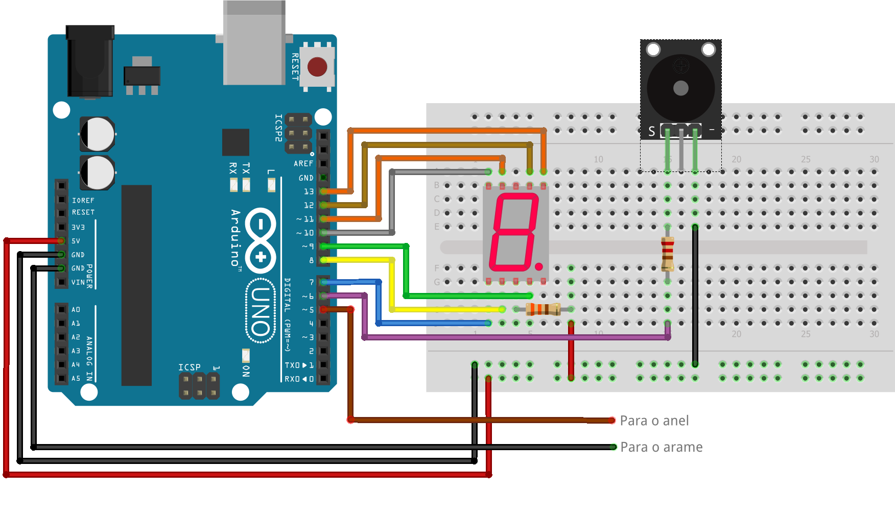

# BuzzWireGameArduino
<div style="display: inline_block">
  
</div>

Um projeto do clássico jogo buzz wire.
O objetivo do jogo é percorrer com um anel por dentro de um arame contorcido.

A cada contato do anel com o arame é soado uma sirene e decrementado uma vida do contador.
Ao acabar as vidas do jogador a sirene soa ininterruptamente até que o Arduino seja reiniciado.

## Uso
Abaixo a montagem da eletrônica do protótipo:



Caso o jogo esteja muito fácil pode-se alterar a linha ```int vidas = 9;``` para menos vidas iniciais ou mudar o formato do arame.
